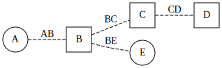

# nxv

Render NetworkX graphs using GraphViz.

# Documentation

https://nxv.readthedocs.io/

# Basic Usage

    import networkx as nx
    import nxv
    
    graph = nx.Graph()
    graph.add_edge("A", "B")
    graph.add_edge("B", "C")
    graph.add_edge("C", "D")
    graph.add_edge("B", "E")

    style = nxv.Style(
        graph={"rankdir": "LR"},
        node=lambda u, d: {"shape": "circle" if u in "AEIOU" else "square"},
        edge=lambda u, v, d: {"style": "dashed", "label": u + v},
    )
    
    nxv.render(graph, style)

# Installation

    pip install nxv

# Development

This repository uses
[Poetry](https://python-poetry.org/) and
[Nox](https://nox.thea.codes/en/stable/)
to manage the development environment and builds.

To list all Nox sessions:

    python -m nox --list-sessions

To run the black code formatter:

    python -m nox -rs black

To lint using flake8:

    python -m nox -rs lint

To run the test suite:

    python -m nox -rs tests

To build the documentation:

    python -m nox -rs docs
