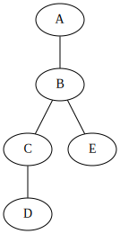

# nxv

nxv renders NetworkX graphs using GraphViz.

- Documentation: https://nxv.readthedocs.io/

# Basic Usage

    import networkx as nx
    import nxv
    
    graph = nx.Graph()
    graph.add_edge("A", "B")
    nxv.render(graph)

# Installation

    pip install nxv

# Development

This repository uses [Poetry](https://python-poetry.org/) and [Nox](https://nox.thea.codes/en/stable/)
to manage the development environment.

To run tests and lint:

    python -m nox
