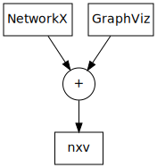

nxv
===

nxv renders `NetworkX`_ graphs using `GraphViz`_.

.. code-block:: python

   import networkx as nx
   import nxv

   graph = nx.Graph()
   style = nxv.Style(...)
   nxv.render(graph, style)

.. toctree::
   :maxdepth: 2

   installation
   quickstart
   reference

.. _NetworkX: https://networkx.github.io/documentation/stable/
.. _GraphViz: https://graphviz.org/
