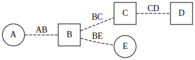

nxv
===

nxv renders `NetworkX`_ graphs using `GraphViz`_.

.. code-block:: python

   import networkx as nx
   import nxv

   graph = nx.Graph()
   graph.add_edge("A", "B")
   graph.add_edge("B", "C")
   graph.add_edge("C", "D")
   graph.add_edge("B", "E")

   style = nxv.Style(
      graph={"rankdir": "LR"},
      node=lambda u, d: {"shape": "circle" if u in "AEIOU" else "square"},
      edge=lambda u, v, d: {"style": "dashed", "label": u + v},
   )

   nxv.render(graph, style)

.. toctree::
   :maxdepth: 2

   installation
   quickstart
   reference
   license

.. _NetworkX: https://networkx.github.io/documentation/stable/
.. _GraphViz: https://graphviz.org/
