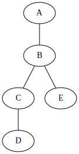

.. _quickstart:

Quickstart
==========

nxv renders `NetworkX`_ graphs using `GraphViz`_.

- :ref:`using-nxv-inside-jupyter` is the easiest and recommended way to get started.
- :ref:`using-nxv-outside-jupyter` describes how to use nxv in other settings.

.. _using-nxv-inside-jupyter:

Using nxv inside of `Jupyter`_
------------------------------

Start by importing networkx and nxv.

.. code-block:: python

   import networkx as nx
   import nxv

Define a simple `NetworkX`_ graph.

.. literalinclude:: ../src/docs.py
   :start-after: BEGIN EXAMPLE
   :end-before: END EXAMPLE
   :dedent: 4
   :pyobject: quickstart_graph

Render the graph with `GraphViz`_ using the :func:`~nxv.render` function.

.. code-block:: python

   nxv.render(graph)

Use a :class:`~nxv.Style` to specify how to style the graph using `GraphViz`_.

.. literalinclude:: ../src/docs.py
   :start-after: BEGIN EXAMPLE
   :end-before: END EXAMPLE
   :dedent: 4
   :pyobject: quickstart_graph_style

See the `GraphViz attributes`_ documentation for information on what attributes are available to use.

Render the graph with the :class:`~nxv.Style` by passing it to the :func:`~nxv.render` function.

.. code-block:: python

   nxv.render(graph, style)

The :class:`~nxv.Style` parameters can be functions that map the parts of a graph to different styles.

.. literalinclude:: ../src/docs.py
   :start-after: BEGIN EXAMPLE
   :end-before: END EXAMPLE
   :dedent: 4
   :pyobject: quickstart_graph_functional_style

.. code-block:: python

   nxv.render(graph, style)

.. image:: _static/example/quickstart_graph_functional_style.svg

.. _using-nxv-outside-jupyter:

Using nxv outside of `Jupyter`_
-------------------------------

Outside of `Jupyter`_, the ``format`` parameter of the :func:`~nxv.render` function is required.
When the ``format`` parameter is provided, the behavior of the :func:`~nxv.render` function is to
return the :class:`bytes` of the result in the specified format.

.. code-block:: python

   data = nxv.render(graph, style, format="svg")
   with open("graph.svg", "wb") as f:
       f.write(data)

.. _NetworkX: https://networkx.github.io/documentation/stable/
.. _GraphViz: https://graphviz.org/
.. _GraphViz attributes: https://graphviz.org/doc/info/attrs.html
.. _Jupyter: https://jupyter.org/install.html
